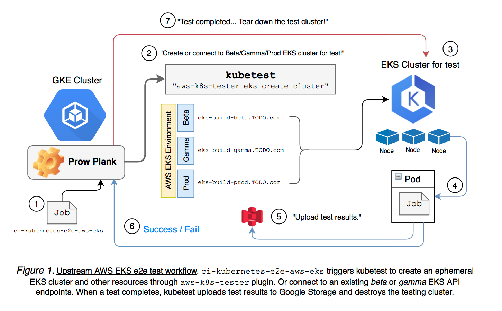
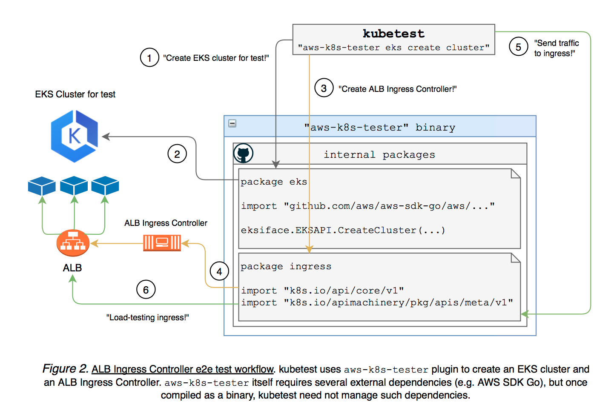

# aws-k8s-tester - kubetest plugin for AWS and EKS

## Table of Contents

<!-- toc -->
- [Summary](#summary)
- [Motivation](#motivation)
  - [Goals](#goals)
  - [Non-Goals](#non-goals)
- [Proposal](#proposal)
  - [User Stories](#user-stories)
    - [Kubernetes E2E test workflow: upstream, Prod EKS builds](#kubernetes-e2e-test-workflow-upstream-prod-eks-builds)
    - [Sub-project E2E test workflow: upstream, ALB Ingress Controller](#sub-project-e2e-test-workflow-upstream-alb-ingress-controller)
  - [Implementation Details/Notes/Constraints](#implementation-detailsnotesconstraints)
  - [Risks and Mitigations](#risks-and-mitigations)
- [Graduation Criteria](#graduation-criteria)
- [Implementation History](#implementation-history)
<!-- /toc -->

## Summary

All e2e tests maintained by AWS uses `aws-k8s-tester` as a plugin to kubetest. `aws-k8s-tester` runs various Kubernetes testing operations (e.g. create a temporary EKS cluster) mainly to implement [`kubernetes/test-infra/kubetest.deployer`](https://github.com/kubernetes/test-infra/blob/40b4010f8e38582a5786adedd4e04cf4e1fc5a36/kubetest/main.go#L222-L229) interface.

## Motivation

Many AWS tests are run by community projects such as [kops](https://github.com/kubernetes/kops), which does not test EKS. Does EKS Service check out-of-range NodePort? Does EKS Service prevent NodePort collisions? Can EKS support 5,000 nodes? There were thousands more to cover. Incomplete test coverage feeds production issues: one component failure may evolve into cluster-wide outage, Kubernetes CSI driver might be incompatible with Amazon EBS, customers may experience scalability problems from untested features, etc. Complete test coverage will unearth such issues beforehand, which leads to better customer experience. This work alone will make a huge impact on improving EKS reliability and its release cadence.

### Goals

The following key features are in scope:

* EKS cluster creation/teardown
* Test open-source Kubernetes distribution (e.g. wrap kubeadm to run Kubernetes e2e tests)
* Create AWS resources to test AWS sub-projects (e.g. create EC2 instances to test CSI driver)

These are the key design principles that guides EKS testing development:

- *Platform Uniformity*: EKS provides a native Kubernetes experience. To keep two platforms in sync, EKS must be tested with upstream Kubernetes. Whenever a new feature is added to Kubernetes, customer should assume it will be tested against EKS. For example, encryption provider feature was added to Kubernetes 1.10 as an alpha feature, but customers have to wait until it becomes a stable feature. Rigorous test coverage will enable more new features to customers at earliest.
- *Maximize Productivity*: Test automation is essential to EKS development productivity at scale. EKS team should do the minimum amount of work possible to upgrade Kubernetes (including etcd). To this end, pre-prod and prod EKS builds will be continuously tested for every PR created in upstream Kubernetes. For example, etcd client upgrade in API server must be tested against EKS control plane components. If the upgrade test fails EKS, we should block the change.
- *Transparency for Community*: We want to contribute EKS tests to upstream and make test results visible to the whole communities. Users should be able to see how EKS performs with 5,000 worker nodes and compare it with other providers, just by looking at upstream performance dashboard.

### Non-Goals

* The project does not replace kops or kubeadm.
* This project is only meant for testing.

## Proposal

### User Stories

#### Kubernetes E2E test workflow: upstream, Prod EKS builds

EKS uses `aws-k8s-tester` as a plugin to kubetest. `aws-k8s-tester` is a broker that creates and deletes AWS resources on behalf of kubetest, connects to pre-prod EKS clusters, reports test results back to dashboards, etc. Every upstream change will be tested against EKS cluster.

Figure 1 shows how AWS would run Kubernetes e2e tests inside EKS (e.g. ci-kubernetes-e2e-aws-eks).

#### Sub-project E2E test workflow: upstream, ALB Ingress Controller

Let's take ALB Ingress Controller for example. Since Kubernetes cluster is a prerequisite to ALB Ingress Controller, `aws-k8s-tester` first creates EKS cluster. Then ALB Ingress Controller plug-in deploys and creates Ingress objects, with sample web server and client. awstester is configured through YAML rather than POSIX flags. This makes it easier to implement sub-project add-ons (e.g. add “alb-ingress-controller” field to set up ingress add-on). Cluster status, ingress controller states, and testing results are persisted to disk for status report and debugging purposes.

Figure 2 shows how `aws-k8s-tester` plugin creates and tests ALB Ingress Controller.

### Implementation Details/Notes/Constraints

We implement kubetest plugin, out-of-tree and provided as a single binary file. Separate code base speeds up development and makes dependency management easier. For example, kops in kubetest uses AWS SDK [v1.12.53](https://github.com/aws/aws-sdk-go/releases/tag/v1.12.53), which was released at December 2017. Upgrading SDK to latest would break existing kops. Packaging everything in a separate binary gives us freedom to choose whatever SDK version we need.

### Risks and Mitigations

* *“aws-k8s-tester” creates a key-pair using EC2 API. Is the private key safely managed?* Each test run creates a temporary key pair and stores the private key on disk. The private key is used to SSH access into Kubernetes worker nodes and read service logs from the EC2 instance. “aws-k8s-tester” safely [deletes the private key on disk](https://github.com/aws/aws-k8s-tester/blob/cde0484f0ae167d8831442a48b4b5e447481af45/internal/ec2/key_pair.go#L65) and [destroys all associated AWS resources](https://github.com/aws/aws-k8s-tester/blob/cde0484f0ae167d8831442a48b4b5e447481af45/internal/ec2/key_pair.go#L71-L73), whether the test completes or get interrupted. For instance, when it deletes the key pair object from EC2, the public key is also deleted, which means the local private key has no use for any threat.
* *Does “aws-k8s-tester” store any sensitive information?* “aws-k8s-tester” maintains a test cluster state in [`ClusterState`](https://godoc.org/github.com/aws/awstester/eksconfig#ClusterState), which is periodically synced to local disk and S3. It does not contain any sensitive data such as private key blobs.
* *Upstream Kubernetes test-infra team mounts our AWS test credential to their Prow cluster. Can anyone access the credential?* Upstream Prow cluster schedules all open-source Kubernetes test runs. In order to test EKS from upstream Kubernetes, AWS credential must be accessible from each test job. Currently, it is mounted as a Secret object (https://kubernetes.io/docs/concepts/configuration/secret/) in upstream Prow cluster. Which means our AWS credential is still stored as base64-encoded plaintext in etcd. Then, there are two ways to access this data. One is to read from Prow testing pod (see [test-infra/PR#9940](https://github.com/kubernetes/test-infra/pull/9940/files)). In theory, any test job has access to “eks-aws-credentials” secret object, thus can maliciously mount it to steal the credential. In practice, every single job needs an approval before it runs any tests. So, if anybody tries to exploit the credential, the change should be rejected beforehand. Two, read the non-encrypted credential data from etcd. This is unlikely as well. We can safely assume that Google GKE deploys etcd in a trusted environment, where the access is restricted to Google test-infra team. See https://kubernetes.io/docs/concepts/configuration/secret/#risks for more.

## Graduation Criteria

`aws-k8s-tester` will be considered successful when it is used by the majority of AWS Kubernetes e2e tests.

## Implementation History

* Initial integration with upstream has been tracked
* Initial proposal to SIG 2018-11-26
* Initial KEP draft 2018-11-26
